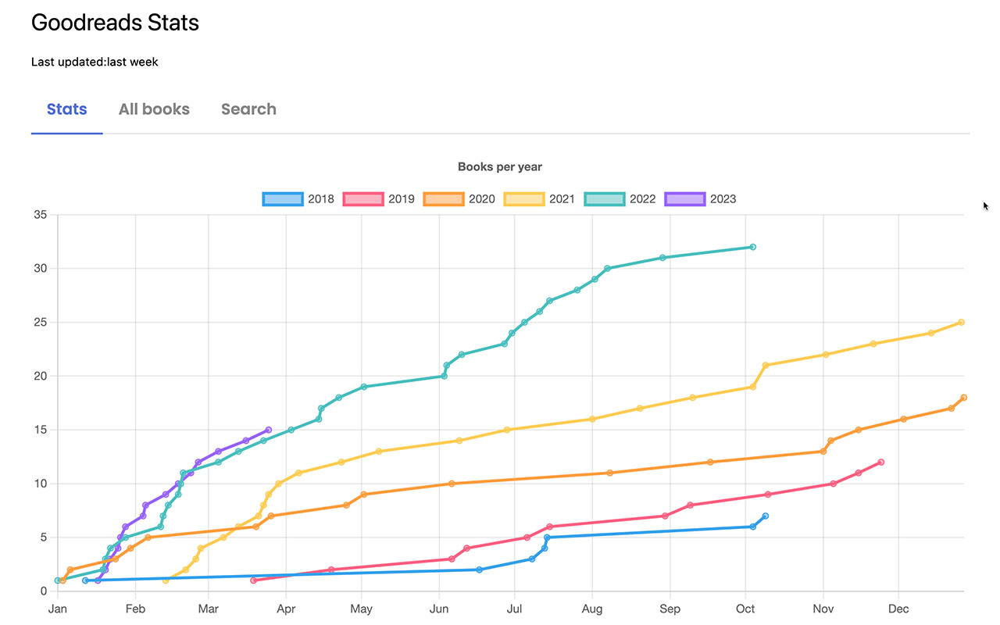
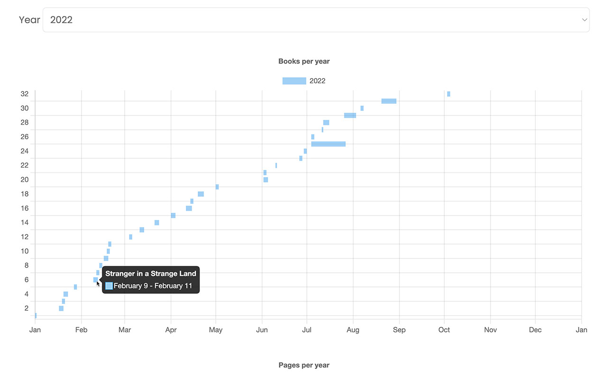
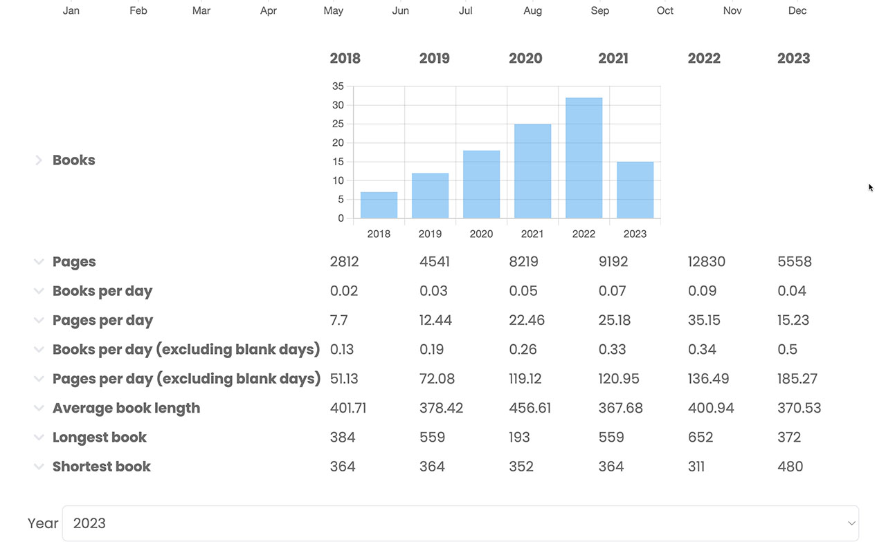
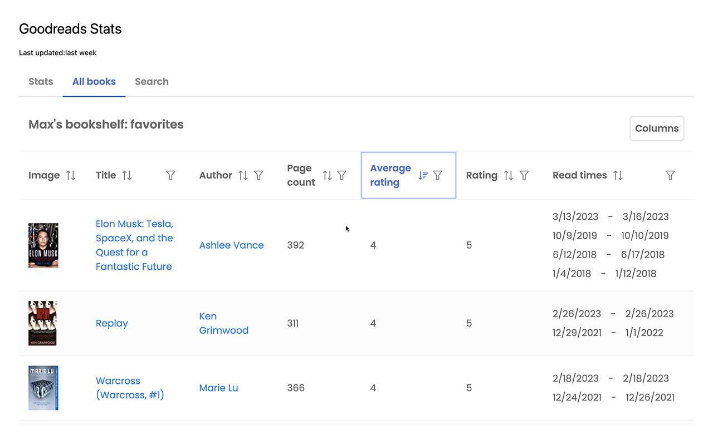
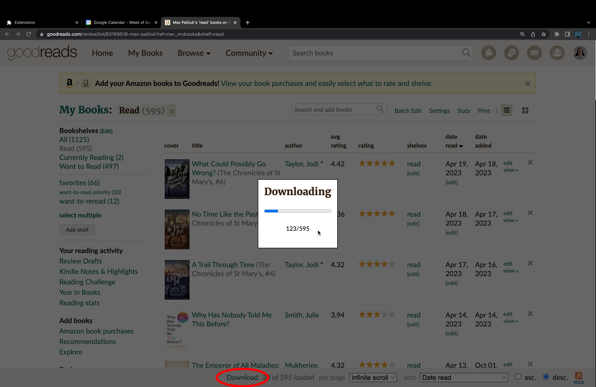

# Goodreads Plus

[A browser extension for Goodreads](https://chrome.google.com/webstore/detail/goodreads-stats/hdpkeldenopncgodhpjdlpngmnaijpjf) that adds data export capability and
displays extensive analytics about your reading habits.

[Add to Chrome](https://chrome.google.com/webstore/detail/goodreads-stats/hdpkeldenopncgodhpjdlpngmnaijpjf)

[Video Demo](https://www.youtube.com/watch?v=f3w99Y45668)

[Report a bug/feature request](https://github.com/maxpatiiuk/goodreads-stats/issues/new/choose)

Also, check out
my [Calendar Plus](https://chrome.google.com/webstore/detail/calendar-plus/kgbbebdcmdgkbopcffmpgkgcmcoomhmh)
extension for Google Calendar power users.

## Features

- Export entire library
- Compare reading rates between years
- Show insights about your favorite books
- Search your entire book library

Can compare reading rate between the years
[](https://www.youtube.com/watch?v=f3w99Y45668)

Can see how long it took to read each book
[](https://www.youtube.com/watch?v=f3w99Y45668)

Can get an extensive breakdown and insights
[](https://www.youtube.com/watch?v=f3w99Y45668)

Can search and filter your entire library
[](https://www.youtube.com/watch?v=f3w99Y45668)

Can download entire library or a single shelf
[](https://www.youtube.com/watch?v=f3w99Y45668)

## Installation

Pre-requisites:

```
Node.js 18
Npm 8
```

(Run all commands from the /src directory)
Install dependencies:

```sh
npm install
```

## Running

Build the front-end for production:

```sh
npm run build
```

## Development

Start the watcher script which would rebuild the code on any changes:

```sh
npm run watch
```

Load unpacked extension into Chrome by [following the
instructions](https://webkul.com/blog/how-to-install-the-unpacked-extension-in-chrome/).

Note, on any code change, you will have to press the `Reload Extension` button
in the top left corner of Google Calendar in order to see the newest changes.

## React DevTools

You may have noticed that despite our app being built with React,
React DevTools browser extension does not work for debugging it.

Instead, a standalone React DevTools (an Electron app) needs to be
used. [Installation
Instructions](https://github.com/facebook/react/tree/main/packages/react-devtools#installation),

Note, this will only work for when WebPack is run in development mode
as we disabled react DevTools integration in production to reduce
bundle size.

## Testing

Unit tests are powered by Jest. Static Typechecking is powered by TypeScript.

You can run both like this:

```sh
npm test
```

or:

```sh
npm t
```

Alternatively, you can start Jest in watch mode:

```
npm run unitTests:watch
```

## Generating Docs

```
cd src
npx typedoc --out docs src
```
